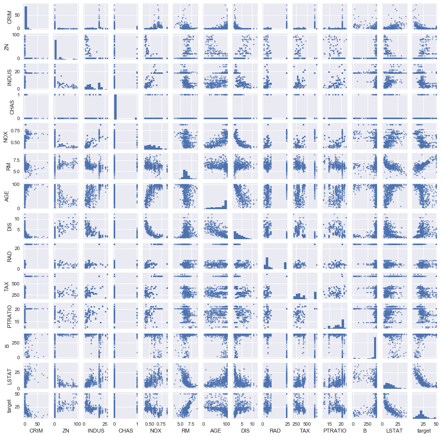
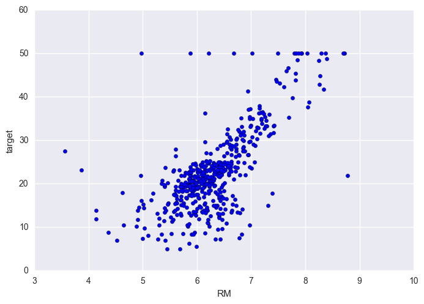
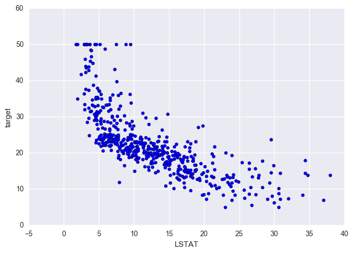
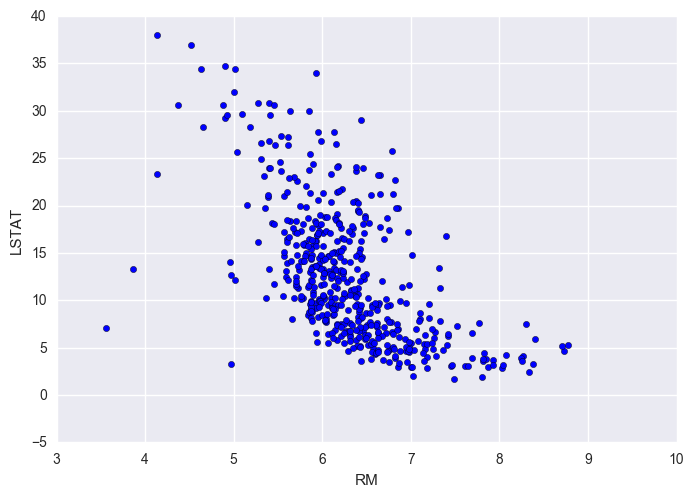
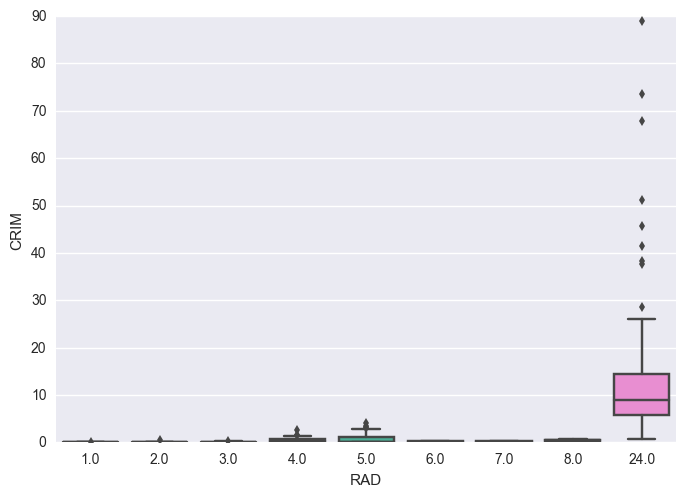
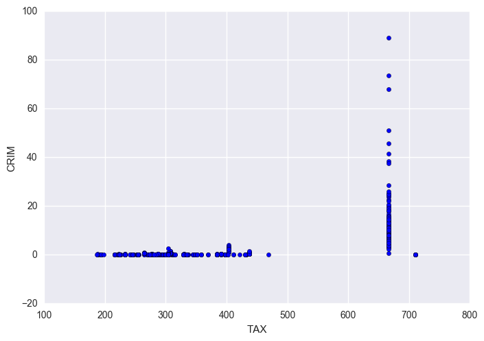
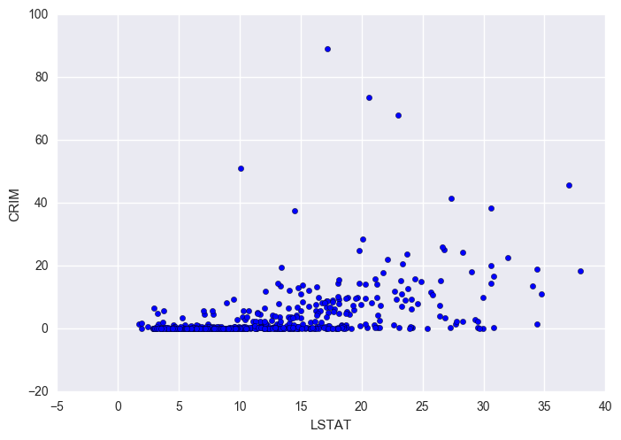

# Exercise 2.10


```python
%matplotlib inline

import pandas as pd
import seaborn as sns
import numpy as np
import matplotlib.pyplot as plt
```

## a) Dataset overview

In Python we can load the Boston dataset using scikit-learn.


```python
from sklearn.datasets import load_boston

boston = load_boston()
df = pd.DataFrame(boston.data, columns=boston.feature_names)
df['target'] = boston.target
```


```python
print(boston['DESCR'])
```

    Boston House Prices dataset
    ===========================
    
    Notes
    ------
    Data Set Characteristics:  
    
        :Number of Instances: 506 
    
        :Number of Attributes: 13 numeric/categorical predictive
        
        :Median Value (attribute 14) is usually the target
    
        :Attribute Information (in order):
            - CRIM     per capita crime rate by town
            - ZN       proportion of residential land zoned for lots over 25,000 sq.ft.
            - INDUS    proportion of non-retail business acres per town
            - CHAS     Charles River dummy variable (= 1 if tract bounds river; 0 otherwise)
            - NOX      nitric oxides concentration (parts per 10 million)
            - RM       average number of rooms per dwelling
            - AGE      proportion of owner-occupied units built prior to 1940
            - DIS      weighted distances to five Boston employment centres
            - RAD      index of accessibility to radial highways
            - TAX      full-value property-tax rate per $10,000
            - PTRATIO  pupil-teacher ratio by town
            - B        1000(Bk - 0.63)^2 where Bk is the proportion of blacks by town
            - LSTAT    % lower status of the population
            - MEDV     Median value of owner-occupied homes in $1000's
    
        :Missing Attribute Values: None
    
        :Creator: Harrison, D. and Rubinfeld, D.L.
    
    This is a copy of UCI ML housing dataset.
    http://archive.ics.uci.edu/ml/datasets/Housing
    
    
    This dataset was taken from the StatLib library which is maintained at Carnegie Mellon University.
    
    The Boston house-price data of Harrison, D. and Rubinfeld, D.L. 'Hedonic
    prices and the demand for clean air', J. Environ. Economics & Management,
    vol.5, 81-102, 1978.   Used in Belsley, Kuh & Welsch, 'Regression diagnostics
    ...', Wiley, 1980.   N.B. Various transformations are used in the table on
    pages 244-261 of the latter.
    
    The Boston house-price data has been used in many machine learning papers that address regression
    problems.   
         
    **References**
    
       - Belsley, Kuh & Welsch, 'Regression diagnostics: Identifying Influential Data and Sources of Collinearity', Wiley, 1980. 244-261.
       - Quinlan,R. (1993). Combining Instance-Based and Model-Based Learning. In Proceedings on the Tenth International Conference of Machine Learning, 236-243, University of Massachusetts, Amherst. Morgan Kaufmann.
       - many more! (see http://archive.ics.uci.edu/ml/datasets/Housing)
    


```python
df.head()
```


<div>
<table border="1" class="dataframe">
  <thead>
    <tr style="text-align: right;">
      <th></th>
      <th>CRIM</th>
      <th>ZN</th>
      <th>INDUS</th>
      <th>CHAS</th>
      <th>NOX</th>
      <th>RM</th>
      <th>AGE</th>
      <th>DIS</th>
      <th>RAD</th>
      <th>TAX</th>
      <th>PTRATIO</th>
      <th>B</th>
      <th>LSTAT</th>
      <th>target</th>
    </tr>
  </thead>
  <tbody>
    <tr>
      <th>0</th>
      <td>0.00632</td>
      <td>18.0</td>
      <td>2.31</td>
      <td>0.0</td>
      <td>0.538</td>
      <td>6.575</td>
      <td>65.2</td>
      <td>4.0900</td>
      <td>1.0</td>
      <td>296.0</td>
      <td>15.3</td>
      <td>396.90</td>
      <td>4.98</td>
      <td>24.0</td>
    </tr>
    <tr>
      <th>1</th>
      <td>0.02731</td>
      <td>0.0</td>
      <td>7.07</td>
      <td>0.0</td>
      <td>0.469</td>
      <td>6.421</td>
      <td>78.9</td>
      <td>4.9671</td>
      <td>2.0</td>
      <td>242.0</td>
      <td>17.8</td>
      <td>396.90</td>
      <td>9.14</td>
      <td>21.6</td>
    </tr>
    <tr>
      <th>2</th>
      <td>0.02729</td>
      <td>0.0</td>
      <td>7.07</td>
      <td>0.0</td>
      <td>0.469</td>
      <td>7.185</td>
      <td>61.1</td>
      <td>4.9671</td>
      <td>2.0</td>
      <td>242.0</td>
      <td>17.8</td>
      <td>392.83</td>
      <td>4.03</td>
      <td>34.7</td>
    </tr>
    <tr>
      <th>3</th>
      <td>0.03237</td>
      <td>0.0</td>
      <td>2.18</td>
      <td>0.0</td>
      <td>0.458</td>
      <td>6.998</td>
      <td>45.8</td>
      <td>6.0622</td>
      <td>3.0</td>
      <td>222.0</td>
      <td>18.7</td>
      <td>394.63</td>
      <td>2.94</td>
      <td>33.4</td>
    </tr>
    <tr>
      <th>4</th>
      <td>0.06905</td>
      <td>0.0</td>
      <td>2.18</td>
      <td>0.0</td>
      <td>0.458</td>
      <td>7.147</td>
      <td>54.2</td>
      <td>6.0622</td>
      <td>3.0</td>
      <td>222.0</td>
      <td>18.7</td>
      <td>396.90</td>
      <td>5.33</td>
      <td>36.2</td>
    </tr>
  </tbody>
</table>
</div>


```python
np.shape(df)
```


    (506, 14)


<b>Number of rows and columns</b>
* 506 rows.
* 14 columns.

<b> Rows and columns description </b>
* Each rows is town in Boston area.
* Columns are features that can influence house price such as per capita crime rate by town ('CRIM').

## b) Scatterplots

* We'll use seaborn to get a quick overview of pairwise relationships


```python
g = sns.PairGrid(df)
g.map_upper(plt.scatter, s=3)
g.map_diag(plt.hist)
g.map_lower(plt.scatter, s=3)
g.fig.set_size_inches(12, 12)
```





```python
plt.scatter(df['RM'], df['target'])
plt.xlabel('RM')
plt.ylabel('target');
```





<b> Findings </b>
* It seems to exist a positive linear relationship between RM and target
* This is expected as RM is the number of rooms (more space, higher price)


```python
plt.scatter(df['LSTAT'], df['target'])
plt.xlabel('LSTAT')
plt.ylabel('target');
```





<b> Findings </b>
* LSTAT and target seem to have a negative non-linear relationship
* This is expected as LSTAT is the percent of lower status people (lower status, lower incomes, cheaper houses)


```python
plt.scatter(df['RM'], df['LSTAT'])
plt.xlabel('RM')
plt.ylabel('LSTAT');
```





<b> Findings </b>
* It seems to exist a negative non-linear relationship between LSTAT and RM
* It makes sense since people with less money (higher LSTAT) can't afford bigger houses (high RM)

## c) Predictors associated with capita crime rate


```python
df.corrwith(df['CRIM']).sort_values()
```


    target    -0.385832
    DIS       -0.377904
    B         -0.377365
    RM        -0.219940
    ZN        -0.199458
    CHAS      -0.055295
    PTRATIO    0.288250
    AGE        0.350784
    INDUS      0.404471
    NOX        0.417521
    LSTAT      0.452220
    TAX        0.579564
    RAD        0.622029
    CRIM       1.000000
    dtype: float64


Looking at the previous scatterplots and the correlation of each variable with 'CRIM', we will have a closer at the 3 with the largest correlation, namely:
* RAD, index of accessibility to radial highways,
* TAX, full-value property-tax rate (in dollars per $10,000),
* LSTAT, percentage of lower status of the population.


```python
ax = sns.boxplot(x="RAD", y="CRIM", data=df)
```





<b> Findings </b>
* When RAD is equal to 24 (its highest value), average CRIM is much higher and CRIM range is much larger.


```python
plt.scatter(df['TAX'], df['CRIM'])
plt.xlabel('TAX')
plt.ylabel('CRIM');
```





<b> Findings </b>
* When TAX is equal to [666](https://en.wikipedia.org/wiki/666_%28number%29#In_mathematics), average CRIM is much higher and CRIM range is much larger.


```python
plt.scatter(df['LSTAT'], df['CRIM'])
plt.xlabel('LSTAT')
plt.ylabel('CRIM');
```





<b> Findings </b>
* For lower values of LSTAT (< 10), CRIM is always under 10. For LSTAT > 10, there is a wider spread of CRIM.
* For LSTAT < 20, a large proportion of the data points is very close to CRIM = 0.

## d) Crime rate, tax rate and pupil-teacher ratio in suburbs


```python
df.ix[df['CRIM'].nlargest(5).index]
```


<div>
<table border="1" class="dataframe">
  <thead>
    <tr style="text-align: right;">
      <th></th>
      <th>CRIM</th>
      <th>ZN</th>
      <th>INDUS</th>
      <th>CHAS</th>
      <th>NOX</th>
      <th>RM</th>
      <th>AGE</th>
      <th>DIS</th>
      <th>RAD</th>
      <th>TAX</th>
      <th>PTRATIO</th>
      <th>B</th>
      <th>LSTAT</th>
      <th>target</th>
    </tr>
  </thead>
  <tbody>
    <tr>
      <th>380</th>
      <td>88.9762</td>
      <td>0.0</td>
      <td>18.1</td>
      <td>0.0</td>
      <td>0.671</td>
      <td>6.968</td>
      <td>91.9</td>
      <td>1.4165</td>
      <td>24.0</td>
      <td>666.0</td>
      <td>20.2</td>
      <td>396.90</td>
      <td>17.21</td>
      <td>10.4</td>
    </tr>
    <tr>
      <th>418</th>
      <td>73.5341</td>
      <td>0.0</td>
      <td>18.1</td>
      <td>0.0</td>
      <td>0.679</td>
      <td>5.957</td>
      <td>100.0</td>
      <td>1.8026</td>
      <td>24.0</td>
      <td>666.0</td>
      <td>20.2</td>
      <td>16.45</td>
      <td>20.62</td>
      <td>8.8</td>
    </tr>
    <tr>
      <th>405</th>
      <td>67.9208</td>
      <td>0.0</td>
      <td>18.1</td>
      <td>0.0</td>
      <td>0.693</td>
      <td>5.683</td>
      <td>100.0</td>
      <td>1.4254</td>
      <td>24.0</td>
      <td>666.0</td>
      <td>20.2</td>
      <td>384.97</td>
      <td>22.98</td>
      <td>5.0</td>
    </tr>
    <tr>
      <th>410</th>
      <td>51.1358</td>
      <td>0.0</td>
      <td>18.1</td>
      <td>0.0</td>
      <td>0.597</td>
      <td>5.757</td>
      <td>100.0</td>
      <td>1.4130</td>
      <td>24.0</td>
      <td>666.0</td>
      <td>20.2</td>
      <td>2.60</td>
      <td>10.11</td>
      <td>15.0</td>
    </tr>
    <tr>
      <th>414</th>
      <td>45.7461</td>
      <td>0.0</td>
      <td>18.1</td>
      <td>0.0</td>
      <td>0.693</td>
      <td>4.519</td>
      <td>100.0</td>
      <td>1.6582</td>
      <td>24.0</td>
      <td>666.0</td>
      <td>20.2</td>
      <td>88.27</td>
      <td>36.98</td>
      <td>7.0</td>
    </tr>
  </tbody>
</table>
</div>


```python
df.ix[df['TAX'].nlargest(5).index]
```


<div>
<table border="1" class="dataframe">
  <thead>
    <tr style="text-align: right;">
      <th></th>
      <th>CRIM</th>
      <th>ZN</th>
      <th>INDUS</th>
      <th>CHAS</th>
      <th>NOX</th>
      <th>RM</th>
      <th>AGE</th>
      <th>DIS</th>
      <th>RAD</th>
      <th>TAX</th>
      <th>PTRATIO</th>
      <th>B</th>
      <th>LSTAT</th>
      <th>target</th>
    </tr>
  </thead>
  <tbody>
    <tr>
      <th>488</th>
      <td>0.15086</td>
      <td>0.0</td>
      <td>27.74</td>
      <td>0.0</td>
      <td>0.609</td>
      <td>5.454</td>
      <td>92.7</td>
      <td>1.8209</td>
      <td>4.0</td>
      <td>711.0</td>
      <td>20.1</td>
      <td>395.09</td>
      <td>18.06</td>
      <td>15.2</td>
    </tr>
    <tr>
      <th>489</th>
      <td>0.18337</td>
      <td>0.0</td>
      <td>27.74</td>
      <td>0.0</td>
      <td>0.609</td>
      <td>5.414</td>
      <td>98.3</td>
      <td>1.7554</td>
      <td>4.0</td>
      <td>711.0</td>
      <td>20.1</td>
      <td>344.05</td>
      <td>23.97</td>
      <td>7.0</td>
    </tr>
    <tr>
      <th>490</th>
      <td>0.20746</td>
      <td>0.0</td>
      <td>27.74</td>
      <td>0.0</td>
      <td>0.609</td>
      <td>5.093</td>
      <td>98.0</td>
      <td>1.8226</td>
      <td>4.0</td>
      <td>711.0</td>
      <td>20.1</td>
      <td>318.43</td>
      <td>29.68</td>
      <td>8.1</td>
    </tr>
    <tr>
      <th>491</th>
      <td>0.10574</td>
      <td>0.0</td>
      <td>27.74</td>
      <td>0.0</td>
      <td>0.609</td>
      <td>5.983</td>
      <td>98.8</td>
      <td>1.8681</td>
      <td>4.0</td>
      <td>711.0</td>
      <td>20.1</td>
      <td>390.11</td>
      <td>18.07</td>
      <td>13.6</td>
    </tr>
    <tr>
      <th>492</th>
      <td>0.11132</td>
      <td>0.0</td>
      <td>27.74</td>
      <td>0.0</td>
      <td>0.609</td>
      <td>5.983</td>
      <td>83.5</td>
      <td>2.1099</td>
      <td>4.0</td>
      <td>711.0</td>
      <td>20.1</td>
      <td>396.90</td>
      <td>13.35</td>
      <td>20.1</td>
    </tr>
  </tbody>
</table>
</div>


```python
df.ix[df['PTRATIO'].nlargest(5).index]
```


<div>
<table border="1" class="dataframe">
  <thead>
    <tr style="text-align: right;">
      <th></th>
      <th>CRIM</th>
      <th>ZN</th>
      <th>INDUS</th>
      <th>CHAS</th>
      <th>NOX</th>
      <th>RM</th>
      <th>AGE</th>
      <th>DIS</th>
      <th>RAD</th>
      <th>TAX</th>
      <th>PTRATIO</th>
      <th>B</th>
      <th>LSTAT</th>
      <th>target</th>
    </tr>
  </thead>
  <tbody>
    <tr>
      <th>354</th>
      <td>0.04301</td>
      <td>80.0</td>
      <td>1.91</td>
      <td>0.0</td>
      <td>0.413</td>
      <td>5.663</td>
      <td>21.9</td>
      <td>10.5857</td>
      <td>4.0</td>
      <td>334.0</td>
      <td>22.0</td>
      <td>382.80</td>
      <td>8.05</td>
      <td>18.2</td>
    </tr>
    <tr>
      <th>355</th>
      <td>0.10659</td>
      <td>80.0</td>
      <td>1.91</td>
      <td>0.0</td>
      <td>0.413</td>
      <td>5.936</td>
      <td>19.5</td>
      <td>10.5857</td>
      <td>4.0</td>
      <td>334.0</td>
      <td>22.0</td>
      <td>376.04</td>
      <td>5.57</td>
      <td>20.6</td>
    </tr>
    <tr>
      <th>127</th>
      <td>0.25915</td>
      <td>0.0</td>
      <td>21.89</td>
      <td>0.0</td>
      <td>0.624</td>
      <td>5.693</td>
      <td>96.0</td>
      <td>1.7883</td>
      <td>4.0</td>
      <td>437.0</td>
      <td>21.2</td>
      <td>392.11</td>
      <td>17.19</td>
      <td>16.2</td>
    </tr>
    <tr>
      <th>128</th>
      <td>0.32543</td>
      <td>0.0</td>
      <td>21.89</td>
      <td>0.0</td>
      <td>0.624</td>
      <td>6.431</td>
      <td>98.8</td>
      <td>1.8125</td>
      <td>4.0</td>
      <td>437.0</td>
      <td>21.2</td>
      <td>396.90</td>
      <td>15.39</td>
      <td>18.0</td>
    </tr>
    <tr>
      <th>129</th>
      <td>0.88125</td>
      <td>0.0</td>
      <td>21.89</td>
      <td>0.0</td>
      <td>0.624</td>
      <td>5.637</td>
      <td>94.7</td>
      <td>1.9799</td>
      <td>4.0</td>
      <td>437.0</td>
      <td>21.2</td>
      <td>396.90</td>
      <td>18.34</td>
      <td>14.3</td>
    </tr>
  </tbody>
</table>
</div>


```python
df.describe()
```


<div>
<table border="1" class="dataframe">
  <thead>
    <tr style="text-align: right;">
      <th></th>
      <th>CRIM</th>
      <th>ZN</th>
      <th>INDUS</th>
      <th>CHAS</th>
      <th>NOX</th>
      <th>RM</th>
      <th>AGE</th>
      <th>DIS</th>
      <th>RAD</th>
      <th>TAX</th>
      <th>PTRATIO</th>
      <th>B</th>
      <th>LSTAT</th>
      <th>target</th>
    </tr>
  </thead>
  <tbody>
    <tr>
      <th>count</th>
      <td>506.000000</td>
      <td>506.000000</td>
      <td>506.000000</td>
      <td>506.000000</td>
      <td>506.000000</td>
      <td>506.000000</td>
      <td>506.000000</td>
      <td>506.000000</td>
      <td>506.000000</td>
      <td>506.000000</td>
      <td>506.000000</td>
      <td>506.000000</td>
      <td>506.000000</td>
      <td>506.000000</td>
    </tr>
    <tr>
      <th>mean</th>
      <td>3.593761</td>
      <td>11.363636</td>
      <td>11.136779</td>
      <td>0.069170</td>
      <td>0.554695</td>
      <td>6.284634</td>
      <td>68.574901</td>
      <td>3.795043</td>
      <td>9.549407</td>
      <td>408.237154</td>
      <td>18.455534</td>
      <td>356.674032</td>
      <td>12.653063</td>
      <td>22.532806</td>
    </tr>
    <tr>
      <th>std</th>
      <td>8.596783</td>
      <td>23.322453</td>
      <td>6.860353</td>
      <td>0.253994</td>
      <td>0.115878</td>
      <td>0.702617</td>
      <td>28.148861</td>
      <td>2.105710</td>
      <td>8.707259</td>
      <td>168.537116</td>
      <td>2.164946</td>
      <td>91.294864</td>
      <td>7.141062</td>
      <td>9.197104</td>
    </tr>
    <tr>
      <th>min</th>
      <td>0.006320</td>
      <td>0.000000</td>
      <td>0.460000</td>
      <td>0.000000</td>
      <td>0.385000</td>
      <td>3.561000</td>
      <td>2.900000</td>
      <td>1.129600</td>
      <td>1.000000</td>
      <td>187.000000</td>
      <td>12.600000</td>
      <td>0.320000</td>
      <td>1.730000</td>
      <td>5.000000</td>
    </tr>
    <tr>
      <th>25%</th>
      <td>0.082045</td>
      <td>0.000000</td>
      <td>5.190000</td>
      <td>0.000000</td>
      <td>0.449000</td>
      <td>5.885500</td>
      <td>45.025000</td>
      <td>2.100175</td>
      <td>4.000000</td>
      <td>279.000000</td>
      <td>17.400000</td>
      <td>375.377500</td>
      <td>6.950000</td>
      <td>17.025000</td>
    </tr>
    <tr>
      <th>50%</th>
      <td>0.256510</td>
      <td>0.000000</td>
      <td>9.690000</td>
      <td>0.000000</td>
      <td>0.538000</td>
      <td>6.208500</td>
      <td>77.500000</td>
      <td>3.207450</td>
      <td>5.000000</td>
      <td>330.000000</td>
      <td>19.050000</td>
      <td>391.440000</td>
      <td>11.360000</td>
      <td>21.200000</td>
    </tr>
    <tr>
      <th>75%</th>
      <td>3.647423</td>
      <td>12.500000</td>
      <td>18.100000</td>
      <td>0.000000</td>
      <td>0.624000</td>
      <td>6.623500</td>
      <td>94.075000</td>
      <td>5.188425</td>
      <td>24.000000</td>
      <td>666.000000</td>
      <td>20.200000</td>
      <td>396.225000</td>
      <td>16.955000</td>
      <td>25.000000</td>
    </tr>
    <tr>
      <th>max</th>
      <td>88.976200</td>
      <td>100.000000</td>
      <td>27.740000</td>
      <td>1.000000</td>
      <td>0.871000</td>
      <td>8.780000</td>
      <td>100.000000</td>
      <td>12.126500</td>
      <td>24.000000</td>
      <td>711.000000</td>
      <td>22.000000</td>
      <td>396.900000</td>
      <td>37.970000</td>
      <td>50.000000</td>
    </tr>
  </tbody>
</table>
</div>


<b> Findings </b>
* The 5 towns shown in CRIM table are particularly high
* All the towns shown in the TAX table have maximum TAX level
* PTRATIO table shows towns with high pupil-teacher ratios but not so uneven

## e) Suburbs bounding the Charles river


```python
df['CHAS'].value_counts()[1]
```


    35


## (f) Median pupil-teacher ratio


```python
df['PTRATIO'].median()
```


    19.05


## (g) Suburb with lowest median value of owner occupied homes


```python
df['target'].idxmin()
```


    398


```python
a = df.describe()
a.loc['range'] = a.loc['max'] - a.loc['min']
a.loc[398] = df.ix[398]
a
```


<div>
<table border="1" class="dataframe">
  <thead>
    <tr style="text-align: right;">
      <th></th>
      <th>CRIM</th>
      <th>ZN</th>
      <th>INDUS</th>
      <th>CHAS</th>
      <th>NOX</th>
      <th>RM</th>
      <th>AGE</th>
      <th>DIS</th>
      <th>RAD</th>
      <th>TAX</th>
      <th>PTRATIO</th>
      <th>B</th>
      <th>LSTAT</th>
      <th>target</th>
    </tr>
  </thead>
  <tbody>
    <tr>
      <th>count</th>
      <td>506.000000</td>
      <td>506.000000</td>
      <td>506.000000</td>
      <td>506.000000</td>
      <td>506.000000</td>
      <td>506.000000</td>
      <td>506.000000</td>
      <td>506.000000</td>
      <td>506.000000</td>
      <td>506.000000</td>
      <td>506.000000</td>
      <td>506.000000</td>
      <td>506.000000</td>
      <td>506.000000</td>
    </tr>
    <tr>
      <th>mean</th>
      <td>3.593761</td>
      <td>11.363636</td>
      <td>11.136779</td>
      <td>0.069170</td>
      <td>0.554695</td>
      <td>6.284634</td>
      <td>68.574901</td>
      <td>3.795043</td>
      <td>9.549407</td>
      <td>408.237154</td>
      <td>18.455534</td>
      <td>356.674032</td>
      <td>12.653063</td>
      <td>22.532806</td>
    </tr>
    <tr>
      <th>std</th>
      <td>8.596783</td>
      <td>23.322453</td>
      <td>6.860353</td>
      <td>0.253994</td>
      <td>0.115878</td>
      <td>0.702617</td>
      <td>28.148861</td>
      <td>2.105710</td>
      <td>8.707259</td>
      <td>168.537116</td>
      <td>2.164946</td>
      <td>91.294864</td>
      <td>7.141062</td>
      <td>9.197104</td>
    </tr>
    <tr>
      <th>min</th>
      <td>0.006320</td>
      <td>0.000000</td>
      <td>0.460000</td>
      <td>0.000000</td>
      <td>0.385000</td>
      <td>3.561000</td>
      <td>2.900000</td>
      <td>1.129600</td>
      <td>1.000000</td>
      <td>187.000000</td>
      <td>12.600000</td>
      <td>0.320000</td>
      <td>1.730000</td>
      <td>5.000000</td>
    </tr>
    <tr>
      <th>25%</th>
      <td>0.082045</td>
      <td>0.000000</td>
      <td>5.190000</td>
      <td>0.000000</td>
      <td>0.449000</td>
      <td>5.885500</td>
      <td>45.025000</td>
      <td>2.100175</td>
      <td>4.000000</td>
      <td>279.000000</td>
      <td>17.400000</td>
      <td>375.377500</td>
      <td>6.950000</td>
      <td>17.025000</td>
    </tr>
    <tr>
      <th>50%</th>
      <td>0.256510</td>
      <td>0.000000</td>
      <td>9.690000</td>
      <td>0.000000</td>
      <td>0.538000</td>
      <td>6.208500</td>
      <td>77.500000</td>
      <td>3.207450</td>
      <td>5.000000</td>
      <td>330.000000</td>
      <td>19.050000</td>
      <td>391.440000</td>
      <td>11.360000</td>
      <td>21.200000</td>
    </tr>
    <tr>
      <th>75%</th>
      <td>3.647423</td>
      <td>12.500000</td>
      <td>18.100000</td>
      <td>0.000000</td>
      <td>0.624000</td>
      <td>6.623500</td>
      <td>94.075000</td>
      <td>5.188425</td>
      <td>24.000000</td>
      <td>666.000000</td>
      <td>20.200000</td>
      <td>396.225000</td>
      <td>16.955000</td>
      <td>25.000000</td>
    </tr>
    <tr>
      <th>max</th>
      <td>88.976200</td>
      <td>100.000000</td>
      <td>27.740000</td>
      <td>1.000000</td>
      <td>0.871000</td>
      <td>8.780000</td>
      <td>100.000000</td>
      <td>12.126500</td>
      <td>24.000000</td>
      <td>711.000000</td>
      <td>22.000000</td>
      <td>396.900000</td>
      <td>37.970000</td>
      <td>50.000000</td>
    </tr>
    <tr>
      <th>range</th>
      <td>88.969880</td>
      <td>100.000000</td>
      <td>27.280000</td>
      <td>1.000000</td>
      <td>0.486000</td>
      <td>5.219000</td>
      <td>97.100000</td>
      <td>10.996900</td>
      <td>23.000000</td>
      <td>524.000000</td>
      <td>9.400000</td>
      <td>396.580000</td>
      <td>36.240000</td>
      <td>45.000000</td>
    </tr>
    <tr>
      <th>398</th>
      <td>38.351800</td>
      <td>0.000000</td>
      <td>18.100000</td>
      <td>0.000000</td>
      <td>0.693000</td>
      <td>5.453000</td>
      <td>100.000000</td>
      <td>1.489600</td>
      <td>24.000000</td>
      <td>666.000000</td>
      <td>20.200000</td>
      <td>396.900000</td>
      <td>30.590000</td>
      <td>5.000000</td>
    </tr>
  </tbody>
</table>
</div>


<b> Findings </b>
* The suburb with the lowest median value is 398.
* Relative to the other towns, this suburb has high CRIM, ZN below quantile 75%, above mean INDUS, does not bound the Charles river, above mean NOX, RM below quantile 25%, maximum AGE, DIS near to the minimum value, maximum RAD, TAX in quantile 75%, PTRATIO as well, B maximum and LSTAT above quantile 75%.

## h) Number of rooms per dwelling 


```python
len(df[df['RM']>7])
```


    64


```python
len(df[df['RM']>8])
```


    13


```python
len(df[df['RM']>8])
```


    13


```python
df[df['RM']>8].describe()
```


<div>
<table border="1" class="dataframe">
  <thead>
    <tr style="text-align: right;">
      <th></th>
      <th>CRIM</th>
      <th>ZN</th>
      <th>INDUS</th>
      <th>CHAS</th>
      <th>NOX</th>
      <th>RM</th>
      <th>AGE</th>
      <th>DIS</th>
      <th>RAD</th>
      <th>TAX</th>
      <th>PTRATIO</th>
      <th>B</th>
      <th>LSTAT</th>
      <th>target</th>
    </tr>
  </thead>
  <tbody>
    <tr>
      <th>count</th>
      <td>13.000000</td>
      <td>13.000000</td>
      <td>13.000000</td>
      <td>13.000000</td>
      <td>13.000000</td>
      <td>13.000000</td>
      <td>13.000000</td>
      <td>13.000000</td>
      <td>13.000000</td>
      <td>13.000000</td>
      <td>13.000000</td>
      <td>13.000000</td>
      <td>13.000000</td>
      <td>13.000000</td>
    </tr>
    <tr>
      <th>mean</th>
      <td>0.718795</td>
      <td>13.615385</td>
      <td>7.078462</td>
      <td>0.153846</td>
      <td>0.539238</td>
      <td>8.348538</td>
      <td>71.538462</td>
      <td>3.430192</td>
      <td>7.461538</td>
      <td>325.076923</td>
      <td>16.361538</td>
      <td>385.210769</td>
      <td>4.310000</td>
      <td>44.200000</td>
    </tr>
    <tr>
      <th>std</th>
      <td>0.901640</td>
      <td>26.298094</td>
      <td>5.392767</td>
      <td>0.375534</td>
      <td>0.092352</td>
      <td>0.251261</td>
      <td>24.608723</td>
      <td>1.883955</td>
      <td>5.332532</td>
      <td>110.971063</td>
      <td>2.410580</td>
      <td>10.529359</td>
      <td>1.373566</td>
      <td>8.092383</td>
    </tr>
    <tr>
      <th>min</th>
      <td>0.020090</td>
      <td>0.000000</td>
      <td>2.680000</td>
      <td>0.000000</td>
      <td>0.416100</td>
      <td>8.034000</td>
      <td>8.400000</td>
      <td>1.801000</td>
      <td>2.000000</td>
      <td>224.000000</td>
      <td>13.000000</td>
      <td>354.550000</td>
      <td>2.470000</td>
      <td>21.900000</td>
    </tr>
    <tr>
      <th>25%</th>
      <td>0.331470</td>
      <td>0.000000</td>
      <td>3.970000</td>
      <td>0.000000</td>
      <td>0.504000</td>
      <td>8.247000</td>
      <td>70.400000</td>
      <td>2.288500</td>
      <td>5.000000</td>
      <td>264.000000</td>
      <td>14.700000</td>
      <td>384.540000</td>
      <td>3.320000</td>
      <td>41.700000</td>
    </tr>
    <tr>
      <th>50%</th>
      <td>0.520140</td>
      <td>0.000000</td>
      <td>6.200000</td>
      <td>0.000000</td>
      <td>0.507000</td>
      <td>8.297000</td>
      <td>78.300000</td>
      <td>2.894400</td>
      <td>7.000000</td>
      <td>307.000000</td>
      <td>17.400000</td>
      <td>386.860000</td>
      <td>4.140000</td>
      <td>48.300000</td>
    </tr>
    <tr>
      <th>75%</th>
      <td>0.578340</td>
      <td>20.000000</td>
      <td>6.200000</td>
      <td>0.000000</td>
      <td>0.605000</td>
      <td>8.398000</td>
      <td>86.500000</td>
      <td>3.651900</td>
      <td>8.000000</td>
      <td>307.000000</td>
      <td>17.400000</td>
      <td>389.700000</td>
      <td>5.120000</td>
      <td>50.000000</td>
    </tr>
    <tr>
      <th>max</th>
      <td>3.474280</td>
      <td>95.000000</td>
      <td>19.580000</td>
      <td>1.000000</td>
      <td>0.718000</td>
      <td>8.780000</td>
      <td>93.900000</td>
      <td>8.906700</td>
      <td>24.000000</td>
      <td>666.000000</td>
      <td>20.200000</td>
      <td>396.900000</td>
      <td>7.440000</td>
      <td>50.000000</td>
    </tr>
  </tbody>
</table>
</div>


```python
df.describe()
```


<div>
<table border="1" class="dataframe">
  <thead>
    <tr style="text-align: right;">
      <th></th>
      <th>CRIM</th>
      <th>ZN</th>
      <th>INDUS</th>
      <th>CHAS</th>
      <th>NOX</th>
      <th>RM</th>
      <th>AGE</th>
      <th>DIS</th>
      <th>RAD</th>
      <th>TAX</th>
      <th>PTRATIO</th>
      <th>B</th>
      <th>LSTAT</th>
      <th>target</th>
    </tr>
  </thead>
  <tbody>
    <tr>
      <th>count</th>
      <td>506.000000</td>
      <td>506.000000</td>
      <td>506.000000</td>
      <td>506.000000</td>
      <td>506.000000</td>
      <td>506.000000</td>
      <td>506.000000</td>
      <td>506.000000</td>
      <td>506.000000</td>
      <td>506.000000</td>
      <td>506.000000</td>
      <td>506.000000</td>
      <td>506.000000</td>
      <td>506.000000</td>
    </tr>
    <tr>
      <th>mean</th>
      <td>3.593761</td>
      <td>11.363636</td>
      <td>11.136779</td>
      <td>0.069170</td>
      <td>0.554695</td>
      <td>6.284634</td>
      <td>68.574901</td>
      <td>3.795043</td>
      <td>9.549407</td>
      <td>408.237154</td>
      <td>18.455534</td>
      <td>356.674032</td>
      <td>12.653063</td>
      <td>22.532806</td>
    </tr>
    <tr>
      <th>std</th>
      <td>8.596783</td>
      <td>23.322453</td>
      <td>6.860353</td>
      <td>0.253994</td>
      <td>0.115878</td>
      <td>0.702617</td>
      <td>28.148861</td>
      <td>2.105710</td>
      <td>8.707259</td>
      <td>168.537116</td>
      <td>2.164946</td>
      <td>91.294864</td>
      <td>7.141062</td>
      <td>9.197104</td>
    </tr>
    <tr>
      <th>min</th>
      <td>0.006320</td>
      <td>0.000000</td>
      <td>0.460000</td>
      <td>0.000000</td>
      <td>0.385000</td>
      <td>3.561000</td>
      <td>2.900000</td>
      <td>1.129600</td>
      <td>1.000000</td>
      <td>187.000000</td>
      <td>12.600000</td>
      <td>0.320000</td>
      <td>1.730000</td>
      <td>5.000000</td>
    </tr>
    <tr>
      <th>25%</th>
      <td>0.082045</td>
      <td>0.000000</td>
      <td>5.190000</td>
      <td>0.000000</td>
      <td>0.449000</td>
      <td>5.885500</td>
      <td>45.025000</td>
      <td>2.100175</td>
      <td>4.000000</td>
      <td>279.000000</td>
      <td>17.400000</td>
      <td>375.377500</td>
      <td>6.950000</td>
      <td>17.025000</td>
    </tr>
    <tr>
      <th>50%</th>
      <td>0.256510</td>
      <td>0.000000</td>
      <td>9.690000</td>
      <td>0.000000</td>
      <td>0.538000</td>
      <td>6.208500</td>
      <td>77.500000</td>
      <td>3.207450</td>
      <td>5.000000</td>
      <td>330.000000</td>
      <td>19.050000</td>
      <td>391.440000</td>
      <td>11.360000</td>
      <td>21.200000</td>
    </tr>
    <tr>
      <th>75%</th>
      <td>3.647423</td>
      <td>12.500000</td>
      <td>18.100000</td>
      <td>0.000000</td>
      <td>0.624000</td>
      <td>6.623500</td>
      <td>94.075000</td>
      <td>5.188425</td>
      <td>24.000000</td>
      <td>666.000000</td>
      <td>20.200000</td>
      <td>396.225000</td>
      <td>16.955000</td>
      <td>25.000000</td>
    </tr>
    <tr>
      <th>max</th>
      <td>88.976200</td>
      <td>100.000000</td>
      <td>27.740000</td>
      <td>1.000000</td>
      <td>0.871000</td>
      <td>8.780000</td>
      <td>100.000000</td>
      <td>12.126500</td>
      <td>24.000000</td>
      <td>711.000000</td>
      <td>22.000000</td>
      <td>396.900000</td>
      <td>37.970000</td>
      <td>50.000000</td>
    </tr>
  </tbody>
</table>
</div>


<b> Comments </b>
* CRIM is lower,
* INDUS proportion is lower,
* % of lower status of the population (LSTAT) is lower.
