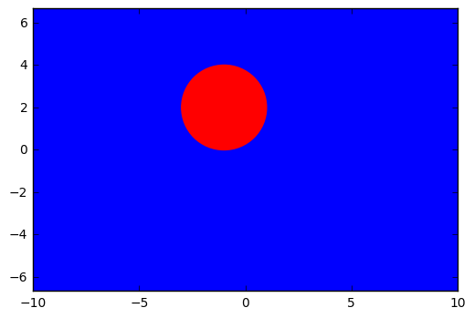
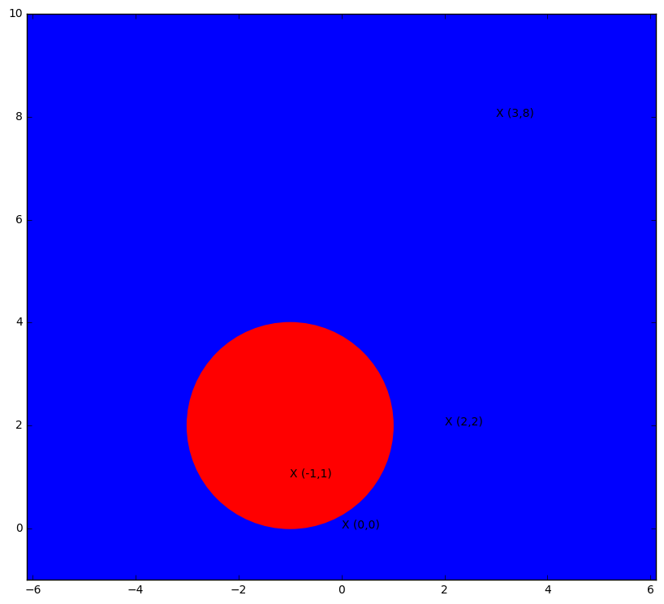

# Exercise 9.2


```python
import pandas as pd
import matplotlib.pyplot as plt

%matplotlib inline
```

# (a)

$(1+X_1)^2+(2-X_2)^2=4$ is the equation of a circle. The circle equation is in the format $(x – h)^2 + (y – k)^2 = r^2$, where *h* and *k* are the center of the circle and *r* is the radius.


```python
# Draw circle
circle =plt.Circle((-1,2), 2, color='r', fill=False)

fig, ax = plt.subplots()

ax.axis("equal")  # To avoid oval circles. Check the References.
ax.add_artist(circle)
ax.set_xlim((-10,10))
ax.set_ylim((-10,10))
```


    (-10, 10)


# (b)


```python
# Draw circle
circle_background =plt.Circle((-1,2), 20, color='b')  # Way to fool matplotlib and have a colored background.
circle =plt.Circle((-1,2), 2, color='r')

fig, ax = plt.subplots()

ax.axis("equal")  # To avoid oval circles. Check the References.
ax.add_artist(circle_background)
ax.add_artist(circle)
ax.set_xlim((-10,10))
ax.set_ylim((-10,10))
plt.show()
```





* $(1+X_1)^2+(2-X_2)^2>4$ - Blue region.
* $(1+X_1)^2+(2-X_2)^2 \leq 4$ - Red region.

# (c)


```python
# Draw circle
circle_background =plt.Circle((-1,2), 20, color='b')  # Way to fool matplotlib and have a colored background.
circle =plt.Circle((-1,2), 2, color='r')

fig, ax = plt.subplots()
fig.set_size_inches(10, 9)

ax.axis("equal")  # To avoid oval circles. Check the References.
ax.add_artist(circle_background)
ax.add_artist(circle)
ax.set_xlim((-10,10))
ax.set_ylim((-1,10))

plt.annotate('X (0,0)', xy=(0,0), xytext=(0,0))
plt.annotate('X (-1,1)', xy=(-1,1), xytext=(-1,1))
plt.annotate('X (2,2)', xy=(2,2), xytext=(2,2))
plt.annotate('X (3,8)', xy=(3,8), xytext=(3,8))
plt.show()
```





* Blue region - (0,0); (2,2); (3,8).
* Red region - (-1,1).

# References

* http://stackoverflow.com/questions/9215658/plot-a-circle-with-pyplot (how to draw a circle)
* http://stackoverflow.com/questions/9230389/why-is-matplotlib-plotting-my-circles-as-ovals/9232513#9232513 (solving matplot oval circles)
