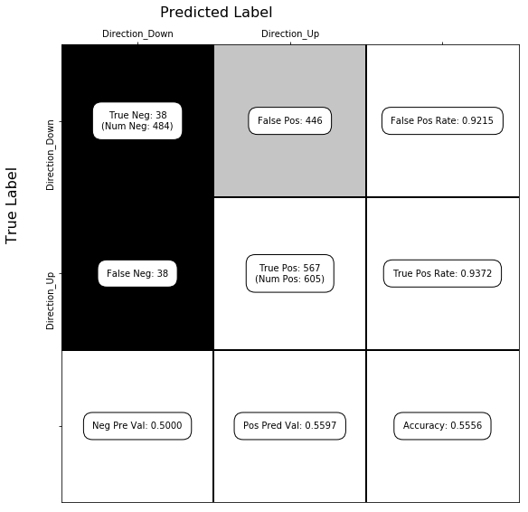

# Exercise 5.7


```python
import numpy as np
import pandas as pd
import seaborn as sns

from sklearn.linear_model import LogisticRegression
from sklearn.metrics import confusion_matrix

df = pd.read_csv("../data/Weekly.csv")

%matplotlib inline
```


```python
df.head()
```


<div>
<style scoped>
    .dataframe tbody tr th:only-of-type {
        vertical-align: middle;
    }

    .dataframe tbody tr th {
        vertical-align: top;
    }

    .dataframe thead th {
        text-align: right;
    }
</style>
<table border="1" class="dataframe">
  <thead>
    <tr style="text-align: right;">
      <th></th>
      <th>Unnamed: 0</th>
      <th>Year</th>
      <th>Lag1</th>
      <th>Lag2</th>
      <th>Lag3</th>
      <th>Lag4</th>
      <th>Lag5</th>
      <th>Volume</th>
      <th>Today</th>
      <th>Direction</th>
    </tr>
  </thead>
  <tbody>
    <tr>
      <th>0</th>
      <td>1</td>
      <td>1990</td>
      <td>0.816</td>
      <td>1.572</td>
      <td>-3.936</td>
      <td>-0.229</td>
      <td>-3.484</td>
      <td>0.154976</td>
      <td>-0.270</td>
      <td>Down</td>
    </tr>
    <tr>
      <th>1</th>
      <td>2</td>
      <td>1990</td>
      <td>-0.270</td>
      <td>0.816</td>
      <td>1.572</td>
      <td>-3.936</td>
      <td>-0.229</td>
      <td>0.148574</td>
      <td>-2.576</td>
      <td>Down</td>
    </tr>
    <tr>
      <th>2</th>
      <td>3</td>
      <td>1990</td>
      <td>-2.576</td>
      <td>-0.270</td>
      <td>0.816</td>
      <td>1.572</td>
      <td>-3.936</td>
      <td>0.159837</td>
      <td>3.514</td>
      <td>Up</td>
    </tr>
    <tr>
      <th>3</th>
      <td>4</td>
      <td>1990</td>
      <td>3.514</td>
      <td>-2.576</td>
      <td>-0.270</td>
      <td>0.816</td>
      <td>1.572</td>
      <td>0.161630</td>
      <td>0.712</td>
      <td>Up</td>
    </tr>
    <tr>
      <th>4</th>
      <td>5</td>
      <td>1990</td>
      <td>0.712</td>
      <td>3.514</td>
      <td>-2.576</td>
      <td>-0.270</td>
      <td>0.816</td>
      <td>0.153728</td>
      <td>1.178</td>
      <td>Up</td>
    </tr>
  </tbody>
</table>
</div>


# (a)


```python
df['Direction_Up'] = (df['Direction'] == 'Up').astype(int)
```


```python
df.head()
```


<div>
<style scoped>
    .dataframe tbody tr th:only-of-type {
        vertical-align: middle;
    }

    .dataframe tbody tr th {
        vertical-align: top;
    }

    .dataframe thead th {
        text-align: right;
    }
</style>
<table border="1" class="dataframe">
  <thead>
    <tr style="text-align: right;">
      <th></th>
      <th>Unnamed: 0</th>
      <th>Year</th>
      <th>Lag1</th>
      <th>Lag2</th>
      <th>Lag3</th>
      <th>Lag4</th>
      <th>Lag5</th>
      <th>Volume</th>
      <th>Today</th>
      <th>Direction</th>
      <th>Direction_Up</th>
    </tr>
  </thead>
  <tbody>
    <tr>
      <th>0</th>
      <td>1</td>
      <td>1990</td>
      <td>0.816</td>
      <td>1.572</td>
      <td>-3.936</td>
      <td>-0.229</td>
      <td>-3.484</td>
      <td>0.154976</td>
      <td>-0.270</td>
      <td>Down</td>
      <td>0</td>
    </tr>
    <tr>
      <th>1</th>
      <td>2</td>
      <td>1990</td>
      <td>-0.270</td>
      <td>0.816</td>
      <td>1.572</td>
      <td>-3.936</td>
      <td>-0.229</td>
      <td>0.148574</td>
      <td>-2.576</td>
      <td>Down</td>
      <td>0</td>
    </tr>
    <tr>
      <th>2</th>
      <td>3</td>
      <td>1990</td>
      <td>-2.576</td>
      <td>-0.270</td>
      <td>0.816</td>
      <td>1.572</td>
      <td>-3.936</td>
      <td>0.159837</td>
      <td>3.514</td>
      <td>Up</td>
      <td>1</td>
    </tr>
    <tr>
      <th>3</th>
      <td>4</td>
      <td>1990</td>
      <td>3.514</td>
      <td>-2.576</td>
      <td>-0.270</td>
      <td>0.816</td>
      <td>1.572</td>
      <td>0.161630</td>
      <td>0.712</td>
      <td>Up</td>
      <td>1</td>
    </tr>
    <tr>
      <th>4</th>
      <td>5</td>
      <td>1990</td>
      <td>0.712</td>
      <td>3.514</td>
      <td>-2.576</td>
      <td>-0.270</td>
      <td>0.816</td>
      <td>0.153728</td>
      <td>1.178</td>
      <td>Up</td>
      <td>1</td>
    </tr>
  </tbody>
</table>
</div>


```python
X = df[['Lag1', 'Lag2']]
y = df['Direction_Up']
```


```python
mod = LogisticRegression(C=10**6, tol=10**-7)
mod.fit(X, y)
```


    LogisticRegression(C=1000000, class_weight=None, dual=False,
              fit_intercept=True, intercept_scaling=1, max_iter=100,
              multi_class='ovr', n_jobs=1, penalty='l2', random_state=None,
              solver='liblinear', tol=1e-07, verbose=0, warm_start=False)


```python
mod.intercept_, mod.coef_
```


    (array([ 0.22122405]), array([[-0.03872222,  0.0602483 ]]))


```python
def show_confusion_matrix(C,class_labels=['0','1']):
    """
    C: ndarray, shape (2,2) as given by scikit-learn confusion_matrix function
    class_labels: list of strings, default simply labels 0 and 1.

    Draws confusion matrix with associated metrics.
    
    Reference: http://notmatthancock.github.io/2015/10/28/confusion-matrix.html
    """
    import matplotlib.pyplot as plt
    import numpy as np
    
    assert C.shape == (2,2), "Confusion matrix should be from binary classification only."
    
    # true negative, false positive, etc...
    tn = C[0,0]; fp = C[0,1]; fn = C[1,0]; tp = C[1,1];

    NP = fn+tp # Num positive examples
    NN = tn+fp # Num negative examples
    N  = NP+NN

    fig = plt.figure(figsize=(8,8))
    ax  = fig.add_subplot(111)
    ax.imshow(C, interpolation='nearest', cmap=plt.cm.gray)

    # Draw the grid boxes
    ax.set_xlim(-0.5,2.5)
    ax.set_ylim(2.5,-0.5)
    ax.plot([-0.5,2.5],[0.5,0.5], '-k', lw=2)
    ax.plot([-0.5,2.5],[1.5,1.5], '-k', lw=2)
    ax.plot([0.5,0.5],[-0.5,2.5], '-k', lw=2)
    ax.plot([1.5,1.5],[-0.5,2.5], '-k', lw=2)

    # Set xlabels
    ax.set_xlabel('Predicted Label', fontsize=16)
    ax.set_xticks([0,1,2])
    ax.set_xticklabels(class_labels + [''])
    ax.xaxis.set_label_position('top')
    ax.xaxis.tick_top()
    # These coordinate might require some tinkering. Ditto for y, below.
    ax.xaxis.set_label_coords(0.34,1.06)

    # Set ylabels
    ax.set_ylabel('True Label', fontsize=16, rotation=90)
    ax.set_yticklabels(class_labels + [''],rotation=90)
    ax.set_yticks([0,1,2])
    ax.yaxis.set_label_coords(-0.09,0.65)


    # Fill in initial metrics: tp, tn, etc...
    ax.text(0,0,
            'True Neg: %d\n(Num Neg: %d)'%(tn,NN),
            va='center',
            ha='center',
            bbox=dict(fc='w',boxstyle='round,pad=1'))

    ax.text(0,1,
            'False Neg: %d'%fn,
            va='center',
            ha='center',
            bbox=dict(fc='w',boxstyle='round,pad=1'))

    ax.text(1,0,
            'False Pos: %d'%fp,
            va='center',
            ha='center',
            bbox=dict(fc='w',boxstyle='round,pad=1'))


    ax.text(1,1,
            'True Pos: %d\n(Num Pos: %d)'%(tp,NP),
            va='center',
            ha='center',
            bbox=dict(fc='w',boxstyle='round,pad=1'))

    # Fill in secondary metrics: accuracy, true pos rate, etc...
    ax.text(2,0,
            'False Pos Rate: %.4f'%(fp / (fp+tn+0.)),
            va='center',
            ha='center',
            bbox=dict(fc='w',boxstyle='round,pad=1'))

    ax.text(2,1,
            'True Pos Rate: %.4f'%(tp / (tp+fn+0.)),
            va='center',
            ha='center',
            bbox=dict(fc='w',boxstyle='round,pad=1'))

    ax.text(2,2,
            'Accuracy: %.4f'%((tp+tn+0.)/N),
            va='center',
            ha='center',
            bbox=dict(fc='w',boxstyle='round,pad=1'))

    ax.text(0,2,
            'Neg Pre Val: %.4f'%(1-fn/(fn+tn+0.)),
            va='center',
            ha='center',
            bbox=dict(fc='w',boxstyle='round,pad=1'))

    ax.text(1,2,
            'Pos Pred Val: %.4f'%(tp/(tp+fp+0.)),
            va='center',
            ha='center',
            bbox=dict(fc='w',boxstyle='round,pad=1'))


    plt.tight_layout()
    plt.show()
```


```python
y_pred = mod.predict(X)

C = confusion_matrix(y, y_pred)    # see exercise 5.5 for more on the confusion matrix
show_confusion_matrix(C, ['Direction_Down', 'Direction_Up'])
```





# (b)


```python
mod.fit(X, y)
print(mod.intercept_, mod.coef_, (mod.predict(X) == y).mean())  # accuracy
mod.fit(X.iloc[1:], y.iloc[1:])
print(mod.intercept_, mod.coef_, (mod.predict(X) == y).mean())
```

    [ 0.22122405] [[-0.03872222  0.0602483 ]] 0.555555555556
    [ 0.22324305] [[-0.03843317  0.06084763]] 0.556473829201


# (c)


```python
mod.predict([X.iloc[0]]), y[0]
```


    (array([1]), 0)


This observation was not correctly classified.

# (d)


```python
n = len(X)
errors = np.zeros(n)

for i in range(n):
    one_out  = ~X.index.isin([i])
    # i.
    mod.fit(X[one_out], y[one_out])
    # ii. iii. iv.
    if mod.predict([X.iloc[i]]) != y[i]:
        errors[i] = 1
```

# (e)


```python
errors.mean()
```


    0.44995408631772266


