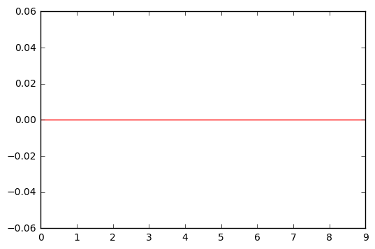
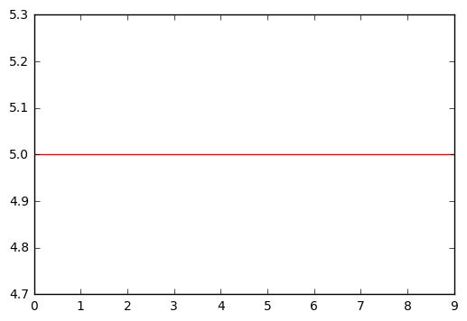
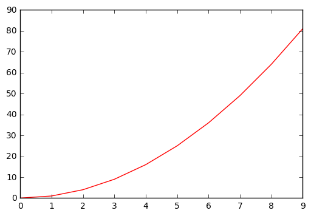

# Exercise 7.2


```python
import pandas as pd
import numpy as np
import matplotlib.pyplot as plt

%matplotlib inline
```

$\hat{g} = arg$ $min_g(\sum_{i=1}^{n} (y_i - g(x_i))^2 + \lambda \int(g^{(m)}(x))^2 dx)$

$arg$ $min_g$ is the value of *g* that minimizes the function.

# (a)

When $\lambda = \infty$ the first term loses significance and can be ignored. If $g^{(0)}(x) = g(x) = 0$ the function will be minimized, which means that <b>$\hat{g}$ must be 0</b>. 


```python
# Example sketch
x = np.arange(0,10,1)
y = np.full(10,0,dtype='int')

plt.plot(x,y,'-r');
```





# (b)

When $\lambda = \infty$ the first term loses significance and can be ignored. If $g^{(1)}(x) = g'(x) = c$ the function will be minimized because the first derivative of a constant is 0. This means that <b>$\hat{g}$ must be an horizontal line</b>. 


```python
# Example sketch
# We used c=5 but it could have been done with any other c.
x = np.arange(0,10,1)
y = np.full(10,5,dtype='int')

plt.plot(x,y,'-r');
```





# (c)

When $\lambda = \infty$ the first term loses significance and can be ignored. If $g^{(2)}(x) = g''(x) = bx + c$ the function will be minimized because the second derivative of a linear function is 0. This means that <b>$\hat{g}$ must be a linear function</b>. 


```python
# Example sketch
# We used y=x but it could have been done with any other linear function.
x = np.arange(0,10,1)
y = np.arange(0,10,1)

plt.plot(x,y,'-r');
```


# (d)

When $\lambda = \infty$ the first term loses significance and can be ignored. If $g^{(3)}(x) = g'''(x) = ax^2 + bx + c$ the function will be minimized because the third derivative of a quadratic function is 0. This means that <b>$\hat{g}$ must be a quadratic function</b>. 


```python
# Example sketch
# We used y=x^2 but it could have been done with any other quadratic function.
x = np.arange(0,10,1)
y = np.arange(0,10,1)**2

plt.plot(x,y,'-r');
```





# (e)

This situation corresponds to a linear regression least squares fit. If $\lambda = 0$, the second term loses significance and can be ignored. Therefore, the function will be minimized when $\sum_{i=1}^{n} (y_i - g(x_i)^2$ is minimum. This means that <b>$\hat{g}$ must be such that it interpolates all of the $y_i$</b>.

Since there are many different shapes that can express this situation, we didn't draw any example sketch.
