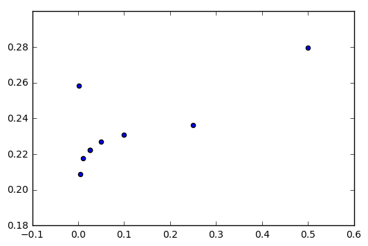

# Exercise 8.10


```python
import pandas as pd
import numpy as np
import matplotlib.pyplot as plt
from sklearn.ensemble import GradientBoostingRegressor
from sklearn.metrics import mean_squared_error
from sklearn.linear_model import LinearRegression
from sklearn.linear_model import LassoCV
from sklearn.ensemble import BaggingRegressor

%matplotlib inline
```


```python
df = pd.read_csv('../data/Hitters.csv', index_col=0)
```


```python
df.head()
```


<div>
<table border="1" class="dataframe">
  <thead>
    <tr style="text-align: right;">
      <th></th>
      <th>AtBat</th>
      <th>Hits</th>
      <th>HmRun</th>
      <th>Runs</th>
      <th>RBI</th>
      <th>Walks</th>
      <th>Years</th>
      <th>CAtBat</th>
      <th>CHits</th>
      <th>CHmRun</th>
      <th>CRuns</th>
      <th>CRBI</th>
      <th>CWalks</th>
      <th>League</th>
      <th>Division</th>
      <th>PutOuts</th>
      <th>Assists</th>
      <th>Errors</th>
      <th>Salary</th>
      <th>NewLeague</th>
    </tr>
  </thead>
  <tbody>
    <tr>
      <th>-Andy Allanson</th>
      <td>293</td>
      <td>66</td>
      <td>1</td>
      <td>30</td>
      <td>29</td>
      <td>14</td>
      <td>1</td>
      <td>293</td>
      <td>66</td>
      <td>1</td>
      <td>30</td>
      <td>29</td>
      <td>14</td>
      <td>A</td>
      <td>E</td>
      <td>446</td>
      <td>33</td>
      <td>20</td>
      <td>NaN</td>
      <td>A</td>
    </tr>
    <tr>
      <th>-Alan Ashby</th>
      <td>315</td>
      <td>81</td>
      <td>7</td>
      <td>24</td>
      <td>38</td>
      <td>39</td>
      <td>14</td>
      <td>3449</td>
      <td>835</td>
      <td>69</td>
      <td>321</td>
      <td>414</td>
      <td>375</td>
      <td>N</td>
      <td>W</td>
      <td>632</td>
      <td>43</td>
      <td>10</td>
      <td>475.0</td>
      <td>N</td>
    </tr>
    <tr>
      <th>-Alvin Davis</th>
      <td>479</td>
      <td>130</td>
      <td>18</td>
      <td>66</td>
      <td>72</td>
      <td>76</td>
      <td>3</td>
      <td>1624</td>
      <td>457</td>
      <td>63</td>
      <td>224</td>
      <td>266</td>
      <td>263</td>
      <td>A</td>
      <td>W</td>
      <td>880</td>
      <td>82</td>
      <td>14</td>
      <td>480.0</td>
      <td>A</td>
    </tr>
    <tr>
      <th>-Andre Dawson</th>
      <td>496</td>
      <td>141</td>
      <td>20</td>
      <td>65</td>
      <td>78</td>
      <td>37</td>
      <td>11</td>
      <td>5628</td>
      <td>1575</td>
      <td>225</td>
      <td>828</td>
      <td>838</td>
      <td>354</td>
      <td>N</td>
      <td>E</td>
      <td>200</td>
      <td>11</td>
      <td>3</td>
      <td>500.0</td>
      <td>N</td>
    </tr>
    <tr>
      <th>-Andres Galarraga</th>
      <td>321</td>
      <td>87</td>
      <td>10</td>
      <td>39</td>
      <td>42</td>
      <td>30</td>
      <td>2</td>
      <td>396</td>
      <td>101</td>
      <td>12</td>
      <td>48</td>
      <td>46</td>
      <td>33</td>
      <td>N</td>
      <td>E</td>
      <td>805</td>
      <td>40</td>
      <td>4</td>
      <td>91.5</td>
      <td>N</td>
    </tr>
  </tbody>
</table>
</div>


```python
df = pd.get_dummies(df)
```


```python
df.head()
```


<div>
<table border="1" class="dataframe">
  <thead>
    <tr style="text-align: right;">
      <th></th>
      <th>AtBat</th>
      <th>Hits</th>
      <th>HmRun</th>
      <th>Runs</th>
      <th>RBI</th>
      <th>Walks</th>
      <th>Years</th>
      <th>CAtBat</th>
      <th>CHits</th>
      <th>CHmRun</th>
      <th>...</th>
      <th>PutOuts</th>
      <th>Assists</th>
      <th>Errors</th>
      <th>Salary</th>
      <th>League_A</th>
      <th>League_N</th>
      <th>Division_E</th>
      <th>Division_W</th>
      <th>NewLeague_A</th>
      <th>NewLeague_N</th>
    </tr>
  </thead>
  <tbody>
    <tr>
      <th>-Andy Allanson</th>
      <td>293</td>
      <td>66</td>
      <td>1</td>
      <td>30</td>
      <td>29</td>
      <td>14</td>
      <td>1</td>
      <td>293</td>
      <td>66</td>
      <td>1</td>
      <td>...</td>
      <td>446</td>
      <td>33</td>
      <td>20</td>
      <td>NaN</td>
      <td>1.0</td>
      <td>0.0</td>
      <td>1.0</td>
      <td>0.0</td>
      <td>1.0</td>
      <td>0.0</td>
    </tr>
    <tr>
      <th>-Alan Ashby</th>
      <td>315</td>
      <td>81</td>
      <td>7</td>
      <td>24</td>
      <td>38</td>
      <td>39</td>
      <td>14</td>
      <td>3449</td>
      <td>835</td>
      <td>69</td>
      <td>...</td>
      <td>632</td>
      <td>43</td>
      <td>10</td>
      <td>475.0</td>
      <td>0.0</td>
      <td>1.0</td>
      <td>0.0</td>
      <td>1.0</td>
      <td>0.0</td>
      <td>1.0</td>
    </tr>
    <tr>
      <th>-Alvin Davis</th>
      <td>479</td>
      <td>130</td>
      <td>18</td>
      <td>66</td>
      <td>72</td>
      <td>76</td>
      <td>3</td>
      <td>1624</td>
      <td>457</td>
      <td>63</td>
      <td>...</td>
      <td>880</td>
      <td>82</td>
      <td>14</td>
      <td>480.0</td>
      <td>1.0</td>
      <td>0.0</td>
      <td>0.0</td>
      <td>1.0</td>
      <td>1.0</td>
      <td>0.0</td>
    </tr>
    <tr>
      <th>-Andre Dawson</th>
      <td>496</td>
      <td>141</td>
      <td>20</td>
      <td>65</td>
      <td>78</td>
      <td>37</td>
      <td>11</td>
      <td>5628</td>
      <td>1575</td>
      <td>225</td>
      <td>...</td>
      <td>200</td>
      <td>11</td>
      <td>3</td>
      <td>500.0</td>
      <td>0.0</td>
      <td>1.0</td>
      <td>1.0</td>
      <td>0.0</td>
      <td>0.0</td>
      <td>1.0</td>
    </tr>
    <tr>
      <th>-Andres Galarraga</th>
      <td>321</td>
      <td>87</td>
      <td>10</td>
      <td>39</td>
      <td>42</td>
      <td>30</td>
      <td>2</td>
      <td>396</td>
      <td>101</td>
      <td>12</td>
      <td>...</td>
      <td>805</td>
      <td>40</td>
      <td>4</td>
      <td>91.5</td>
      <td>0.0</td>
      <td>1.0</td>
      <td>1.0</td>
      <td>0.0</td>
      <td>0.0</td>
      <td>1.0</td>
    </tr>
  </tbody>
</table>
<p>5 rows × 23 columns</p>
</div>


# (a)


```python
# Remove observations for whom the salary information is unknown.
df = df.dropna(subset=['Salary'])
```


```python
# Log transform salaries
df['Salary'] = np.log(df['Salary'])
```

# (b)


```python
# Create training and testing 
# We don't use the train_test_split because we don't want to split data randomly.
X = df.drop(['Salary'], axis=1)
y = df['Salary']

X_train = X.ix[:200,:]
y_train = y.ix[:200]
X_test = X.ix[200:,:]
y_test = y.ix[200:]
```

# (c)


```python
# Boosting with different shrinkage values
shrinkage_values = [.001, .025, .005, .01, .025, .05, .1, .25, .5]
mses = []
for i in shrinkage_values:
    bst = GradientBoostingRegressor(learning_rate=i, n_estimators=1000, random_state=1)
    bst.fit(X_train, y_train)
    mses.append(mean_squared_error(y_train, bst.predict(X_train)))
```


```python
# Plot training set MSE for different shrinkage values
plt.scatter(shrinkage_values, mses)
```


    <matplotlib.collections.PathCollection at 0xf98e0f0>


# (d)


```python
# Boosting with different shrinkage values
shrinkage_values = [.001, .025, .005, .01, .025, .05, .1, .25, .5]
mses = []
for i in shrinkage_values:
    bst = GradientBoostingRegressor(learning_rate=i, n_estimators=1000, random_state=1)
    bst.fit(X_train, y_train)
    mses.append(mean_squared_error(y_test, bst.predict(X_test)))
```


```python
# Plot training set MSE for different shrinkage values
plt.scatter(shrinkage_values, mses)
```


    <matplotlib.collections.PathCollection at 0xf9f5240>





```python
# Get minimum test MSE value
print('Minimum test MSE:', np.min(mses))
```

    Minimum test MSE: 0.208753925111


```python
# Index of the shrinkage_value that leads to the minimum test MSE
np.where(mses == np.min(mses))
```


    (array([2], dtype=int64),)


# (e)


```python
# Linear regression
rgr = LinearRegression()
rgr.fit(X_train, y_train)

print('Minimum test MSE:', mean_squared_error(y_test, rgr.predict(X_test)))
```

    Minimum test MSE: 0.491795937545


```python
# Cross-validated lasso
lasso = LassoCV(cv=5)
lasso.fit(X_train, y_train)

print('Minimum test MSE:', mean_squared_error(y_test, lasso.predict(X_test)))
```

    Minimum test MSE: 0.486586369603


The test MSE obtained using boosting is lower than the test MSE obtained using a linear regression or a lasso regularized regression. This means that, according to this error metric, boosting is the model with better predictive capacity.

# (f)


```python
# Plot features importance to understand their importance.
bst = GradientBoostingRegressor(learning_rate=0.005)  # 0.005 is the learning_rate corresponding to the best test MSE
bst.fit(X_train, y_train)

feature_importance = bst.feature_importances_*100
rel_imp = pd.Series(feature_importance, index=X.columns).sort_values(inplace=False)
rel_imp.T.plot(kind='barh', color='r')
plt.xlabel('Variable importance')
```


    <matplotlib.text.Text at 0xd682e10>


According to the figure, the most important predictors seem to be: CAtBat, AtBat, CRuns, Walks and CRBI.

# (g)


```python
# Fit bagging regressor
bagging = BaggingRegressor()
bagging.fit(X_train, y_train)
```


    BaggingRegressor(base_estimator=None, bootstrap=True,
             bootstrap_features=False, max_features=1.0, max_samples=1.0,
             n_estimators=10, n_jobs=1, oob_score=False, random_state=None,
             verbose=0, warm_start=False)


```python
# Test MSE
print('Test MSE:', mean_squared_error(y_test, bagging.predict(X_test)))
```

    Test MSE: 0.253358375264

