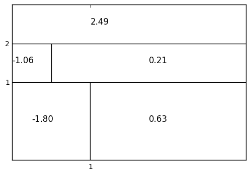

# Exercise 8.4


```python
import pandas as pd
import matplotlib.pyplot as plt

%matplotlib inline
```

# (a)

----------------X1<=1----------------

----------------- | -----------------

--------X2<=1---------------Y=5------

--------- | -------------------------

---X1<=0------Y=15-------------------

--- | -------------------------------

Y=3---X2<=0--------------------------

------- | ---------------------------

----Y=10--Y=0------------------------

We didn't find the beautiful way of doing this, but we believe you'll find and share with us :)

# (b)


```python
# Plot according to the tree presented in the figure
plt.plot()
plt.xlim(-1,5)
plt.ylim(-1,3)
plt.xticks([1])
plt.yticks([1,2])
plt.vlines(1, ymin=-5, ymax=1)
plt.vlines(0, ymin=1, ymax=2)
plt.hlines(1, xmin=-5, xmax=5)
plt.hlines(2, xmin=-5, xmax=5)
plt.annotate('-1.80', xy=(-.5,0), fontsize=12)
plt.annotate('-1.06', xy=(-1,1.5), fontsize=12)
plt.annotate('0.63', xy=(2.5,0), fontsize=12)
plt.annotate('0.21', xy=(2.5,1.5), fontsize=12)
plt.annotate('2.49', xy=(1,2.5), fontsize=12)
```


    <matplotlib.text.Annotation at 0xc486e10>




